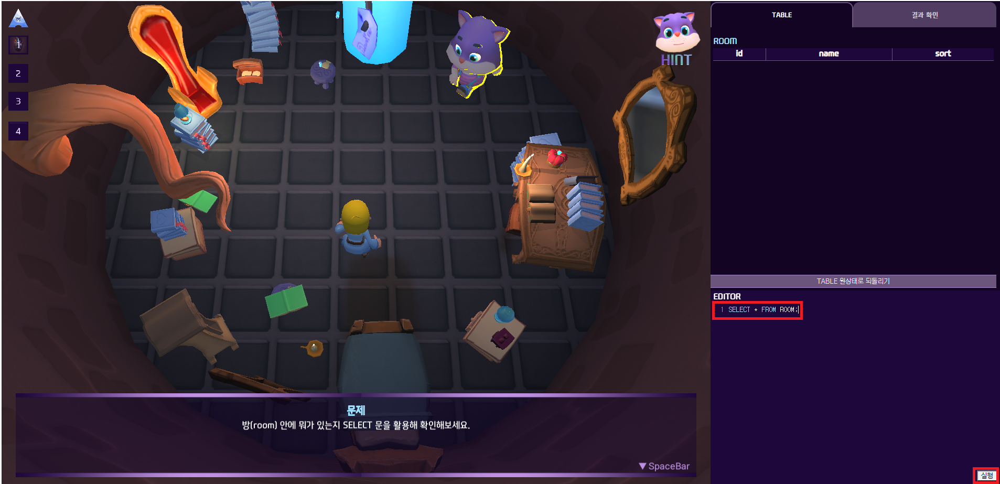

## ASL 시연 시나리오

> 화면은 크게 게임화면, 테이블 결과, 에디터로 구성됩니다.

> 문제가 주어지는 동안은 움직일 수 없습니다.

> SQL을 작성하고 실행버튼을 누를 수 있습니다.

> 실행하면 결과가 나타나게 됩니다.
>
> 정답인 경우에 정답이라는 표시가 나타나고 클릭을 통해서 다음 스토리를 진행할 수 있습니다.

> 자유롭게 이동하며 NPC나 사물과 커뮤니케이션을 할 수 있습니다.

> 커뮤니케이션이 가능한 NPC나 사물은 가까이 다가가면 대화창이 나타납니다.

#### 정답

[정답 파일](../document/answers/ASL_answers.md)

